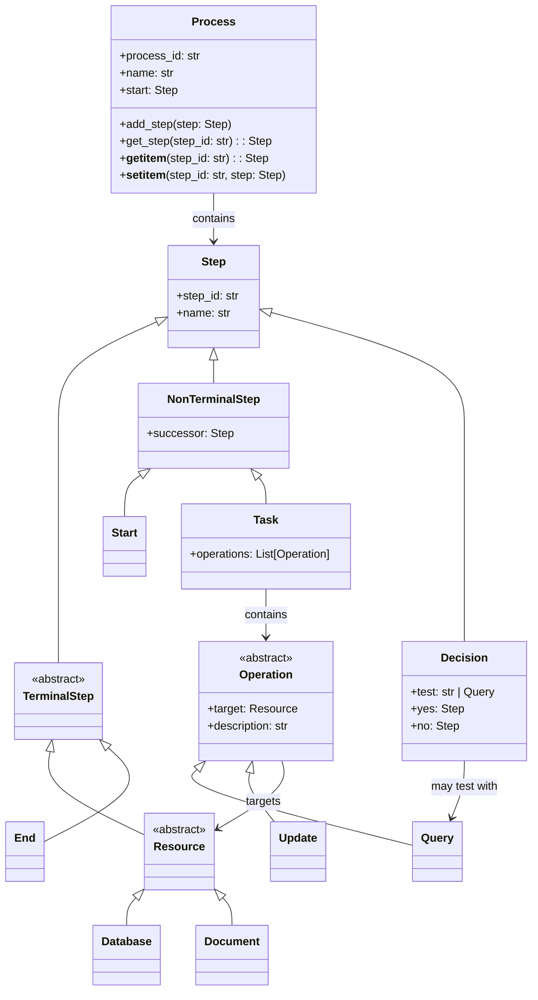
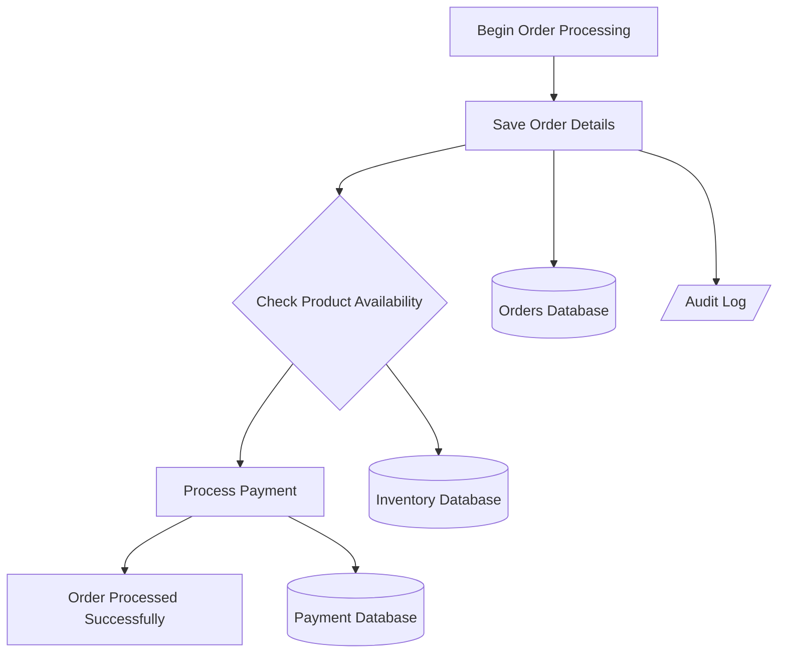

# mermaid-mint

A Python DSL for creating rich process diagrams with database and document operations that can be converted to Mermaid flowcharts.

The project is usable but under active development.

The code and documentation were developed by Claude code pairing with me (Romilly Cocking).

## Overview

Mermaid-mint allows you to define business processes using a comprehensive YAML syntax and convert them to Mermaid diagram format. The DSL supports complex workflows with data operations, resource management, and dynamic decision-making. The project follows strict TDD principles and uses clean architectural patterns.

## Features

- **Process Definition**: Define processes with Start, Task, Decision, and End steps
- **Resource Management**: Database and Document resources with operations
- **Data Operations**: Query and Update operations on resources
- **Dynamic Decisions**: Decision steps with Query-based tests
- **YAML Input**: Human-readable YAML format for process definitions
- **Mermaid Output**: Generate rich Mermaid flowchart syntax with proper resource visualization
- **Extensible Architecture**: Dictionary dispatch patterns and visitor pattern for easy extension

## Object Model



## Quick Start

### Define a Process with Resources and Operations

```yaml
process:
  process_id: "order_processing"
  name: "Order Processing Workflow"
  
steps:
  - step_id: "start"
    type: "Start"
    name: "Begin Order Processing"
    successor: "save_order"
    
  - step_id: "save_order"
    type: "Task"
    name: "Save Order Details"
    operations:
      - type: "Update"
        target: "orders_db"
        description: "Insert new order record"
      - type: "Update"
        target: "audit_log"
        description: "Log order creation event"
    successor: "check_inventory"
    
  - step_id: "check_inventory"
    type: "Decision"
    name: "Check Product Availability"
    test:
      type: "Query"
      target: "inventory_db"
      description: "Check if product is in stock"
    "yes": "process_payment"
    "no": "backorder"
    
  - step_id: "process_payment"
    type: "Task"
    name: "Process Payment"
    operations:
      - type: "Update"
        target: "payment_db"
        description: "Record payment transaction"
    successor: "end_success"
    
  - step_id: "orders_db"
    type: "Database"
    name: "Orders Database"
    
  - step_id: "inventory_db"
    type: "Database"
    name: "Inventory Database"
    
  - step_id: "payment_db"
    type: "Database"
    name: "Payment Database"
    
  - step_id: "audit_log"
    type: "Document"
    name: "Audit Log"
    
  - step_id: "end_success"
    type: "End"
    name: "Order Processed Successfully"
```

### Convert to Mermaid

Using the Python API:

```python
from mermaid_mint.parser import Parser
from mermaid_mint.visitors import MermaidVisitor

# Parse YAML
parser = Parser()
process = parser.parse_file("order_processing.yaml")

# Generate Mermaid diagram
visitor = MermaidVisitor()
mermaid_output = visitor.visit_process(process)
print(mermaid_output)
```

Using the command-line converter:

```bash
cd examples
python convert_to_mermaid.py order_processing.yaml
```

This generates a `.mmd` file with rich Mermaid syntax:



### Examples

See the `examples/` directory for:
- **order_processing.yaml**: Complete workflow with databases, documents, and operations
- **convert_to_mermaid.py**: Command-line converter script

## Architecture

### Key Design Decisions

See `docs/adr/` for detailed architectural decision records:

- **ADR-0002**: Use dataclasses for step objects
- **ADR-0003**: String-based parser testing for better debugging
- **ADR-0004**: Visitor pattern for extensible output formats

### Core Components

- **`mermaid_mint.steps`**: Complete object model with inheritance hierarchy
  - Steps: Start, Task, Decision, End
  - Resources: Database, Document  
  - Operations: Query, Update
  - Process: Container with Pythonic indexing
- **`mermaid_mint.parser`**: YAML to Process object conversion with operation resolution
- **`mermaid_mint.visitors`**: Output format generators with resource visualization

### Design Patterns

- **Dictionary Dispatch**: Used in Parser and MermaidVisitor for extensibility
- **Visitor Pattern**: For generating different output formats
- **Pythonic Indexing**: Process objects support `process[step_id]` syntax

## Development

### Setup

```bash
# Activate virtual environment
source venv/bin/activate

# Install in development mode
pip install -e .[test]
```

### Testing

```bash
# Run all tests
pytest

# Run with verbose output
pytest -v

# Run specific test file
pytest tests/test_parser.py -v
```

### Project follows strict TDD

See `CLAUDE.md` for detailed TDD workflow and guidelines.

## Installation

```bash
# Clone the repository
git clone <repository-url>
cd mermaid-mint

# Create and activate virtual environment (recommended)
python -m venv venv
source venv/bin/activate  # On Windows: venv\Scripts\activate

# Install in development mode
pip install -e .
```

## Changelog

### v0.2.0 - Resource and Operations Model
✅ **Complete**: Comprehensive DSL with inheritance hierarchy (TerminalStep, NonTerminalStep)  
✅ **Complete**: Resource model (Database, Document) with operations (Query, Update)  
✅ **Complete**: Enhanced Task steps with multiple operations  
✅ **Complete**: Dynamic Decision steps with Query-based tests  
✅ **Complete**: YAML parsing with operation resolution  
✅ **Complete**: Rich Mermaid output with resource visualization  
✅ **Complete**: Working examples with command-line converter  

### v0.1.0 - Basic DSL Foundation
✅ **Complete**: Basic DSL with all step types  
✅ **Complete**: YAML parsing with proper boolean handling  
✅ **Complete**: Mermaid output generation  
✅ **Complete**: Comprehensive test coverage (15 tests)  
✅ **Complete**: Clean architecture with established patterns
