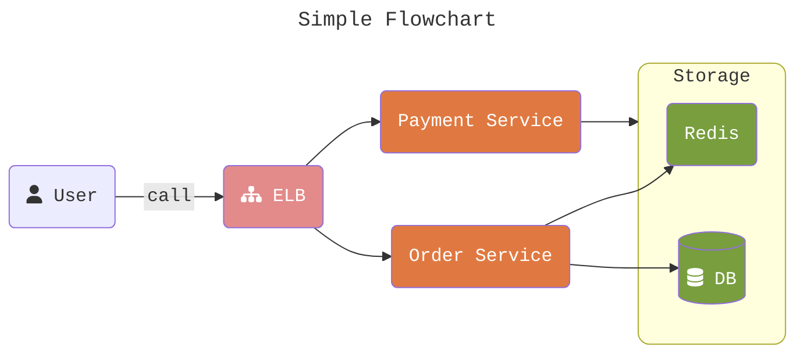

```mermaid
---
title: Simple Flowchart
---
%%{init: {"theme": "light", "themeVariables": {"fontFamily": "Monospace"}, "themeCSS": ".edgeLabel p { padding: 0px 3px; }"}}%%
flowchart LR
    user@{shape: rounded, label: "fa:fa-user User"}--> |call|elb:::gateway@{shape: rounded, label: "fa:fa-sitemap ELB"}
    order_service:::api@{shape: rounded, label: "Order Service"}-->redis:::storage@{shape: rounded, label: "Redis"}
    order_service:::api@{shape: rounded, label: "Order Service"}-->db:::storage@{shape: cyl, label: "fa:fa-database DB"}
    style storage rx:10,ry:10
    subgraph storage [Storage]
        direction TB
        redis:::storage@{shape: rounded, label: "Redis"}
        db:::storage@{shape: cyl, label: "fa:fa-database DB"}
    end
    payment_service:::api@{shape: rounded, label: "Payment Service"}-->storage
    elb:::gateway@{shape: rounded, label: "fa:fa-sitemap ELB"}-->order_service:::api@{shape: rounded, label: "Order Service"}
    elb:::gateway@{shape: rounded, label: "fa:fa-sitemap ELB"}-->payment_service:::api@{shape: rounded, label: "Payment Service"}
classDef gateway fill:#E38A8A,color:#FFFFFF
classDef api fill:#E07941,color:#FFFFFF
classDef storage fill:#789E3E,color:#FFFFFF
```